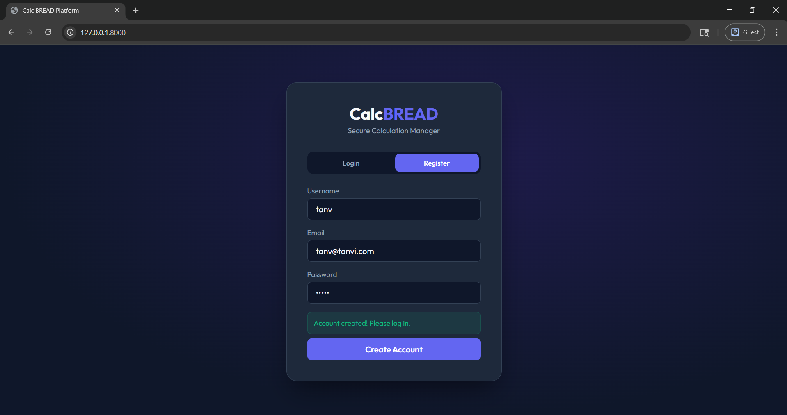
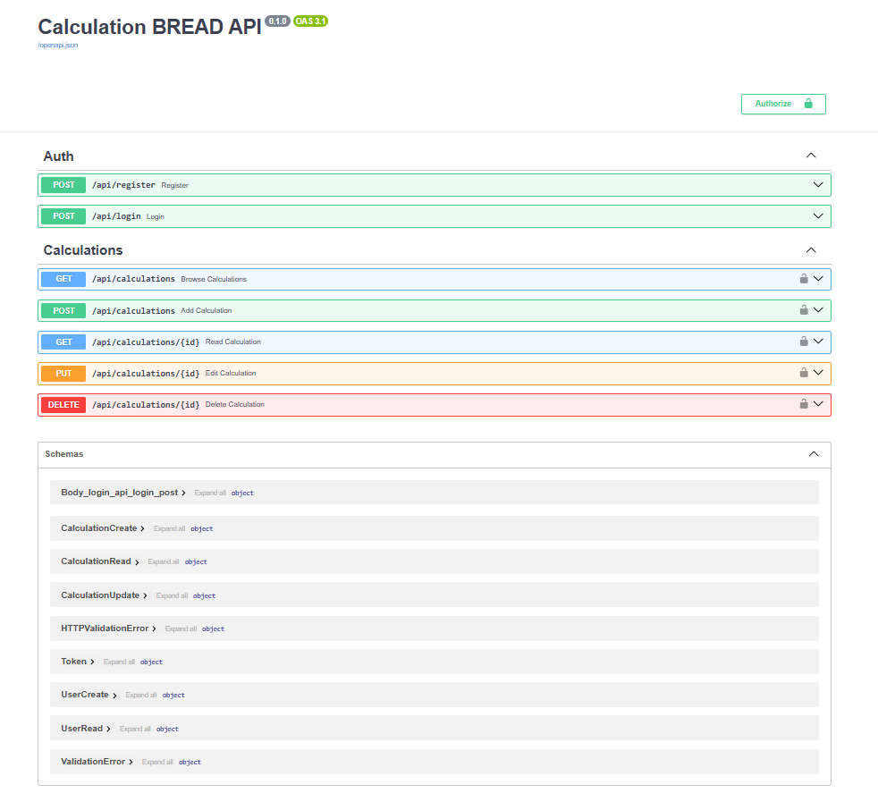
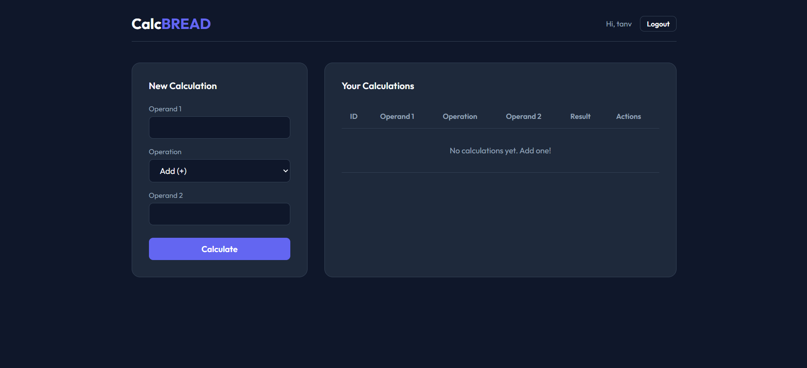
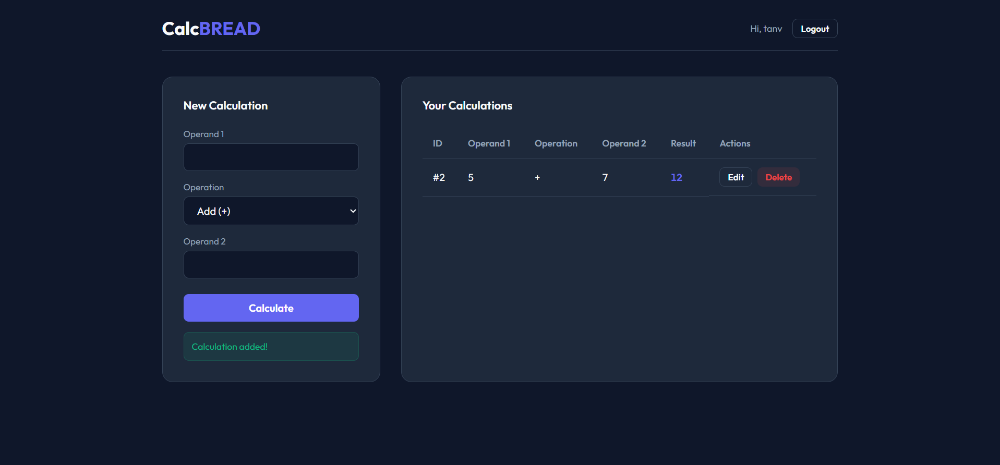
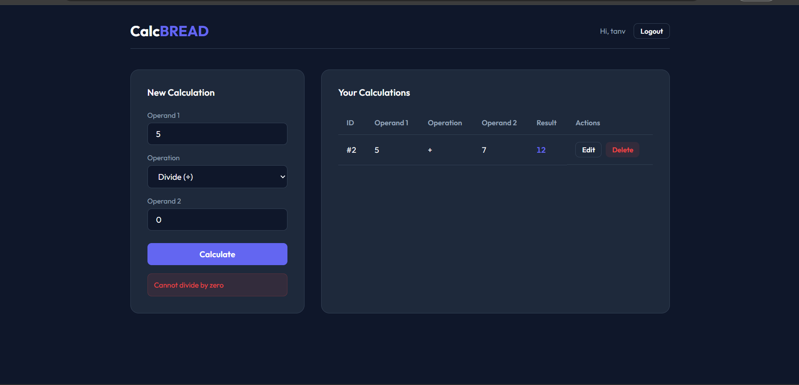
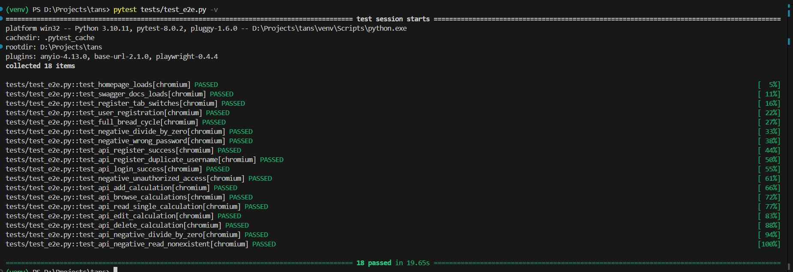
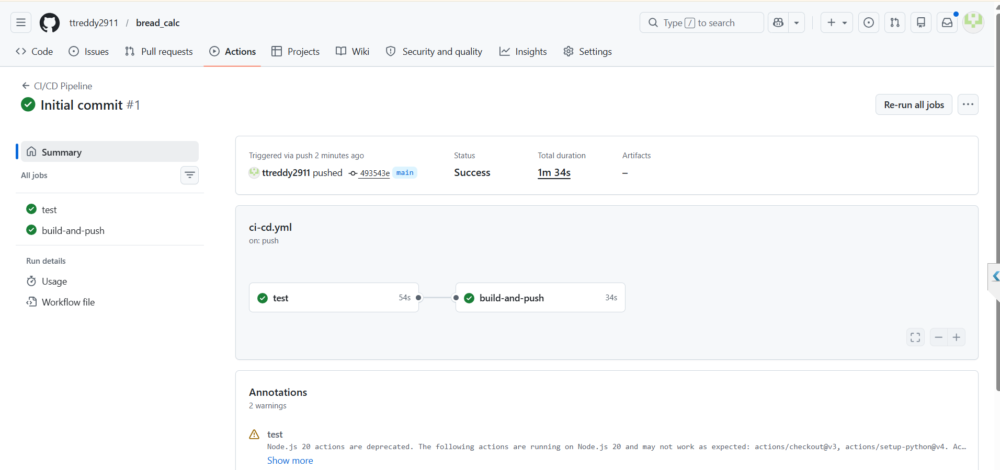
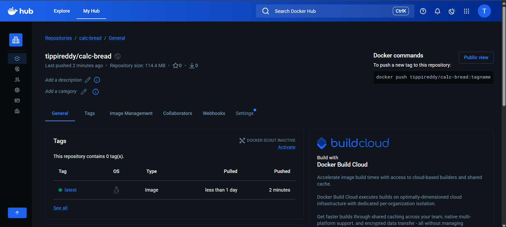

# 🧮 Calculation BREAD REST API

A full-stack web application implementing **BREAD** (Browse, Read, Edit, Add, Delete) operations for user-owned calculations, secured by **JWT Authentication**.

Built with **FastAPI + SQLite**, served alongside a dynamic **Vanilla JS** single-page application. Automatically tested using **18 Playwright & API tests** and deployed to **Docker Hub** via **GitHub Actions CI/CD**.

> 📄 **Reflection Document:** See [Reflection.md](Reflection.md) for key experiences and challenges faced during development and deployment.

---

## 🚀 Tech Stack

| Layer | Technology |
|---|---|
| Backend | Python 3.11 + FastAPI |
| Database | SQLite (SQLAlchemy ORM) |
| Authentication | JWT (python-jose + passlib/bcrypt) |
| Frontend | Vanilla HTML / CSS / JavaScript |
| Testing | Pytest + Playwright (18 E2E & API tests) |
| CI/CD | GitHub Actions |
| Deployment | Docker Hub |

---

## 📸 Screenshots

### Application UI — Login & Dashboard


### Swagger API Documentation (`/docs`)


### Browse & Read — Viewing Calculations


### Edit Calculation


### Negative Scenario — Error Handling


### All 18 Playwright & API Tests Passing


### GitHub Actions CI/CD Pipeline (Green ✅)


### Docker Hub — Image Published


---

## 📋 BREAD Endpoints

All calculation endpoints require a valid JWT Bearer token (obtained via Login).

| Letter | Operation | Method | Endpoint |
|---|---|---|---|
| **B** | Browse — get all your calculations | `GET` | `/api/calculations` |
| **R** | Read — get one specific calculation | `GET` | `/api/calculations/{id}` |
| **E** | Edit — update a calculation | `PUT` | `/api/calculations/{id}` |
| **A** | Add — create a new calculation | `POST` | `/api/calculations` |
| **D** | Delete — remove a calculation | `DELETE` | `/api/calculations/{id}` |

### Auth Endpoints (no token required)
| Method | Endpoint | Description |
|---|---|---|
| `POST` | `/api/register` | Create a new user account |
| `POST` | `/api/login` | Login and receive JWT token |

> 📖 Full interactive API docs available at **`http://localhost:8000/docs`** (Swagger UI)

---

## ⚙️ Running Locally

### Prerequisites
- Python 3.9+

### 1. Clone & Install
```bash
git clone https://github.com/ttreddy2911/BREAD_Endpoints-_for_Calculations.git
cd BREAD_Endpoints-_for_Calculations
python -m venv venv
.\venv\Scripts\activate
pip install -r requirements.txt
```

### 2. Start the Application Server
```bash
uvicorn app.main:app --reload
```

Then open **`http://localhost:8000`** in your browser:
- Click **Register** to create a new account
- Switch to **Login** and sign in with your credentials
- Start adding, editing and deleting calculations!

---

## 🧪 Running Automated Tests

First time only — install Playwright browsers:
```bash
playwright install
```

Run the full 18-test suite:
```bash
pytest tests/test_e2e.py -v
```

### Test Coverage (18 tests)

| # | Test | Type | Scenario |
|---|---|---|---|
| 1 | `test_homepage_loads` | UI | Auth screen renders correctly |
| 2 | `test_swagger_docs_loads` | UI | Swagger /docs loads |
| 3 | `test_register_tab_switches` | UI | Tab switcher works |
| 4 | `test_user_registration` | UI ✅ Positive | Register new account |
| 5 | `test_full_bread_cycle` | UI ✅ Positive | Add → Edit → Delete |
| 6 | `test_negative_divide_by_zero` | UI ❌ Negative | Error shown for ÷0 |
| 7 | `test_negative_wrong_password` | UI ❌ Negative | Wrong password rejected |
| 8 | `test_api_register_success` | API ✅ Positive | POST /register → 201 |
| 9 | `test_api_register_duplicate_username` | API ❌ Negative | Duplicate → 400 |
| 10 | `test_api_login_success` | API ✅ Positive | POST /login → JWT token |
| 11 | `test_negative_unauthorized_access` | API ❌ Negative | No token → 401 |
| 12 | `test_api_add_calculation` | API ✅ Positive | POST /calculations → 201 |
| 13 | `test_api_browse_calculations` | API ✅ Positive | GET /calculations → list |
| 14 | `test_api_read_single_calculation` | API ✅ Positive | GET /calculations/{id} |
| 15 | `test_api_edit_calculation` | API ✅ Positive | PUT /calculations/{id} |
| 16 | `test_api_delete_calculation` | API ✅ Positive | DELETE → 204, then 404 |
| 17 | `test_api_negative_divide_by_zero` | API ❌ Negative | ÷0 → 400 |
| 18 | `test_api_negative_read_nonexistent` | API ❌ Negative | Missing ID → 404 |

---

## 🐳 Docker Hub

The Docker image is automatically built and pushed on every push to `main`.

**Docker Hub:** [`https://hub.docker.com/r/tippireddy/calc-bread`](https://hub.docker.com/r/tippireddy/calc-bread)

To pull and run directly:
```bash
docker pull tippireddy/calc-bread:latest
docker run -p 8000:8000 tippireddy/calc-bread:latest
```

---

## 🔧 CI/CD Pipeline

Configured in `.github/workflows/ci-cd.yml`. On every push to `main`:
1. ✅ Installs Python 3.11 and all dependencies
2. ✅ Installs Playwright Chromium browser
3. ✅ Runs all 18 Pytest E2E tests
4. ✅ If tests pass → builds Docker image via `Dockerfile`
5. ✅ Pushes image to Docker Hub using encrypted repository secrets

### Required GitHub Repository Secrets
Go to **Settings → Secrets and variables → Actions** and add:
- `DOCKERHUB_USERNAME` = your Docker Hub **username** (not email — check hub.docker.com top-right after login)
- `DOCKERHUB_TOKEN` = your Docker Hub **Access Token** (hub.docker.com → Account Settings → Security → New Access Token)
